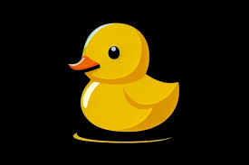

### In Progress 🧠✨.
#### My notes 

## 1- algorithms.
## 2- data_structure.
## 3- Data Base.
## 4- SOLID principles.
## 5- Object Oriented Programming (OOP).
## 6- Application Programming Interface (API).
## 7- Design Patterns (In Progress).

