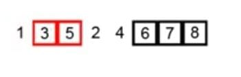
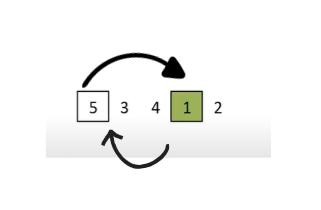
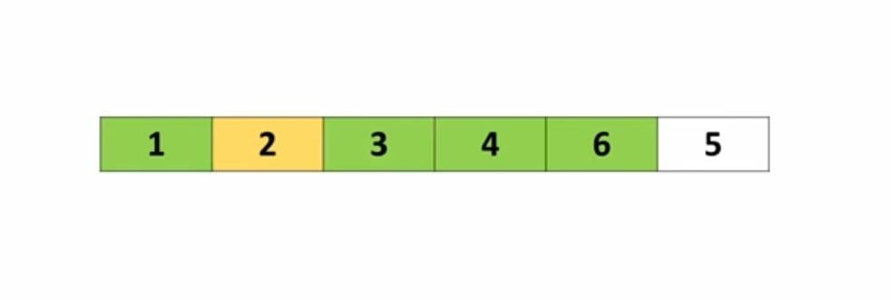
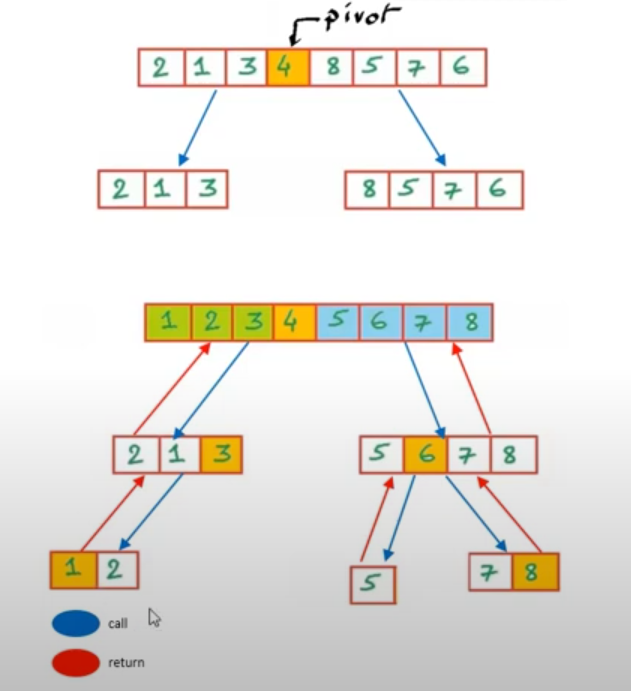

⚡ *Algorithms*

A set of instruction that solve a specific problem (time - space).

1- Sorting Algorithms (Bubble sort, Selection sort, Insertion sort, Divide and Conquer (Merge Sort, Quick Sort))

✍🏻 Bubble sort
بقارن كل رقمين جمب ببعض ولو عاوز ارتب تصاعدى اجيب الصغير فيهم يسار وهكذا

✍🏻 Selection sort
نبحث عن أصغر او أكبر عنصر ثم نقوم باستبدال العنصر دا بأول عنصر

✍🏻 Insertion sort

شبه ال bubble sort بقارن كل رقمين جمب بعض والاصغر اجيبه يسار  لو ترتيب تصاعدى بس،
 الاختلاف بقى لازم كل الجنب اليسار يكون مترتب 
يعنى بمسك عنصرين وكمان عنصرين وارجع للعنصريين ال ف الجانب الأيسر اشوفهم تمام ولالا واكمل

✍🏻 Quick sort

2- Search Algorithms (Binary Search, Breadth-First Search)

3- Graph Algorithms (Dijkstra's Algorithm, A* Search)

4- Dynamic Programming (Knapsack Problem)

5- Greedy Algorithms (Huffman Coding, Prim's Algorithm)
