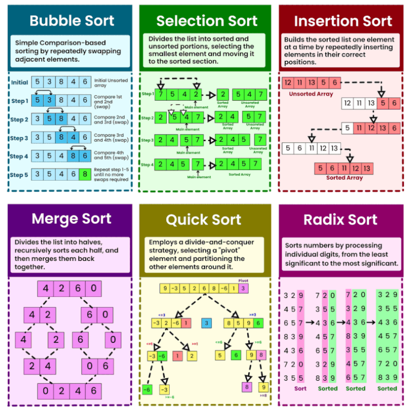
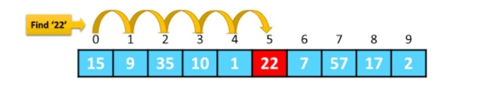

⚡ *Algorithms*

A set of instruction that solve a specific problem (time - space).

1- Sorting Algorithms (Bubble sort, Selection sort, Insertion sort, Divide and Conquer (Quick Sort, Merge Sort))

✍🏻 Bubble sort :
بقارن كل رقمين جمب ببعض ولو عاوز ارتب تصاعدى اجيب الصغير فيهم يسار وهكذا

✍🏻 Selection sort :
نبحث عن أصغر او أكبر عنصر ثم نقوم باستبدال العنصر دا بأول عنصر

✍🏻 Insertion sort :
بقسم الليست الي جزئين جزء مرتب وجزء غير مرتب يتم اخد كل عنصر من الجزء غير المرتب وادخاله فى المكان المناسب داخل الجزء المرتب

✍🏻 Quick sort :

 يتم اختيار عنصر محوري (pivot) وتقسيم القائمة إلى جزئين: جزء يحتوي على العناصر الأصغر من المحور والآخر على العناصر الأكبر. يتم ترتيب الجزئين بشكل منفصل.

✍🏻 Merge sort :
يتم تقسيم القائمة إلى نصفين، ويتم ترتيب كل نصف بشكل منفصل ثم دمجهما مرة أخرى.

2- Search Algorithms (Linear Search, Binary Search, Breadth-First Search (BFS), Depth-First Search (DFS))

✍🏻 Linear Search
بمشى علي الليست عنصر عنصر لحد ما الاقى العنصر المطلوب

3- Graph Algorithms (Dijkstra's Algorithm, A* Search)

4- Dynamic Programming (Knapsack Problem)

5- Greedy Algorithms (Huffman Coding, Prim's Algorithm)
