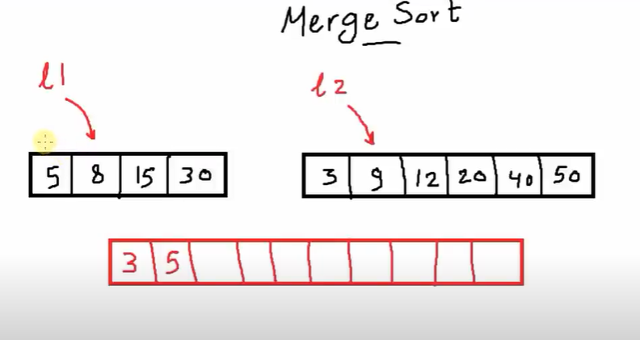

⚡ *Algorithms*

A set of instruction that solve a specific problem (time - space).

1- Sorting Algorithms (Bubble sort, Selection sort, Insertion sort, Divide and Conquer (Quick Sort, Merge Sort))

✍🏻 Bubble sort
بقارن كل رقمين جمب ببعض ولو عاوز ارتب تصاعدى اجيب الصغير فيهم يسار وهكذا

✍🏻 Selection sort
نبحث عن أصغر او أكبر عنصر ثم نقوم باستبدال العنصر دا بأول عنصر

✍🏻 Insertion sort
بقسم الليست الي جزئين جزء مرتب وجزء غير مرتب يتم اخد كل عنصر من الجزء غير المرتب وادخاله فى المكان المناسب داخل الجزء المرتب

✍🏻 Quick sort

✍🏻 Merge sort

2- Search Algorithms (Binary Search, Breadth-First Search)

3- Graph Algorithms (Dijkstra's Algorithm, A* Search)

4- Dynamic Programming (Knapsack Problem)

5- Greedy Algorithms (Huffman Coding, Prim's Algorithm)
