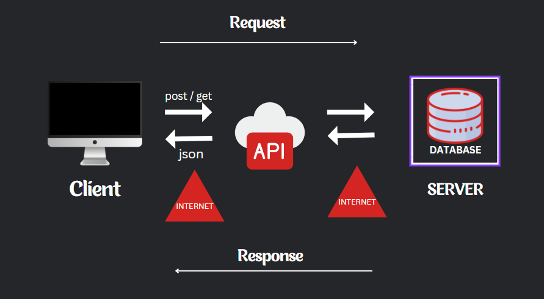

API

(Application Programming Interface)

وظيفته ارسال واستقبال داتا معينه من والي السيرفر

- [Api MY PDF](https://www.canva.com/design/DAF-LVZGF3w/AvfH-cGecgzs9hk4x6Ka2w/edit?utm_content=DAF-LVZGF3w&utm_campaign=designshare&utm_medium=link2&utm_source=sharebutton)
