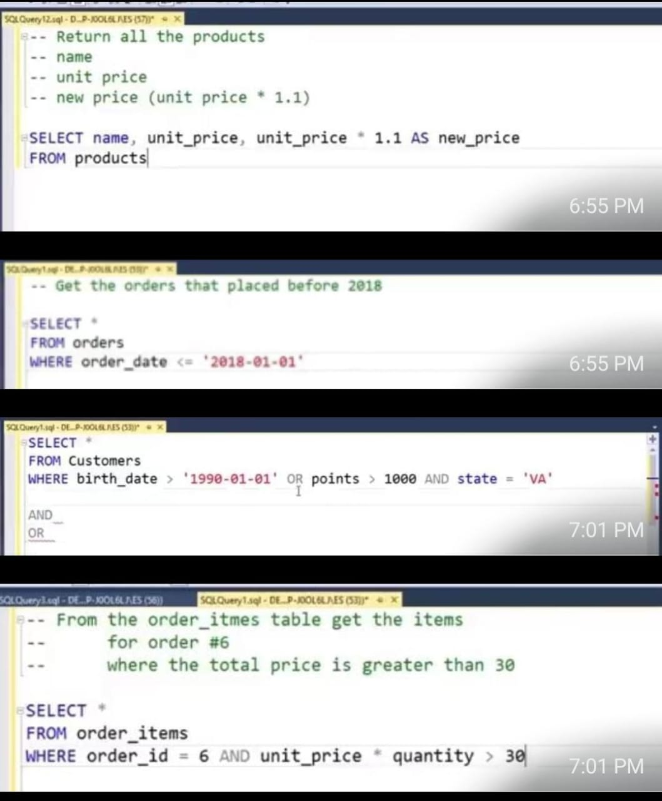
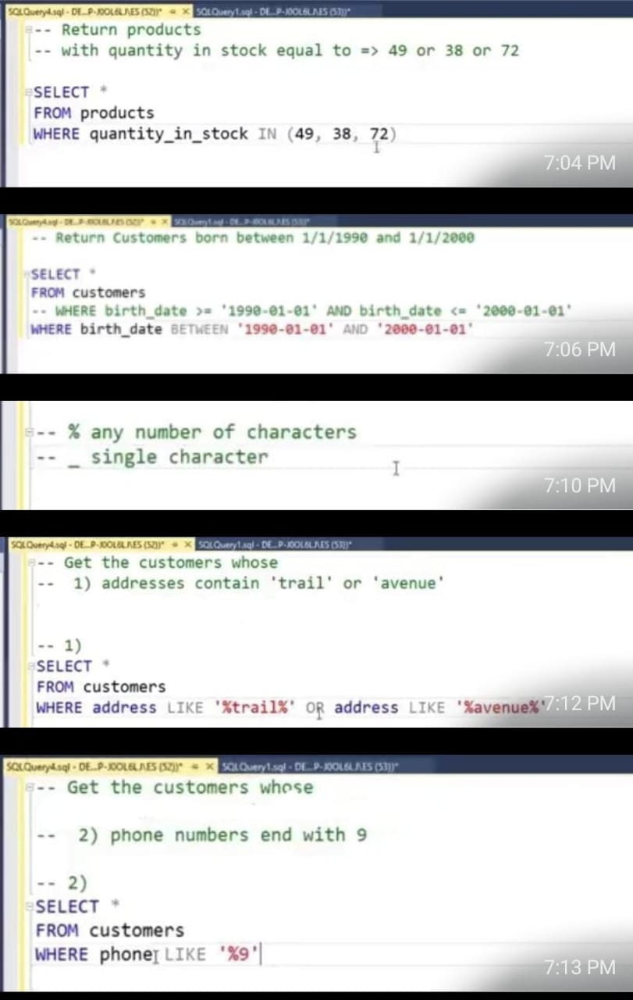
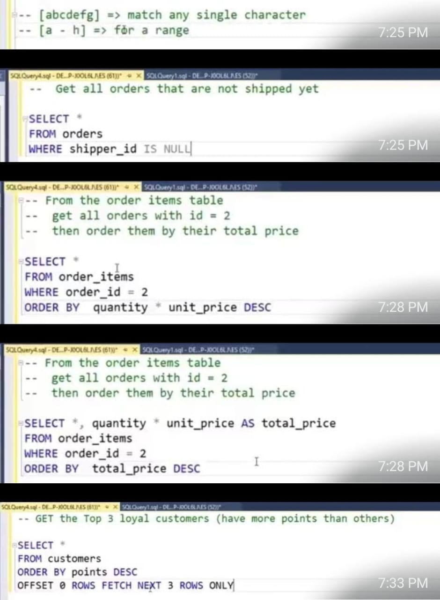
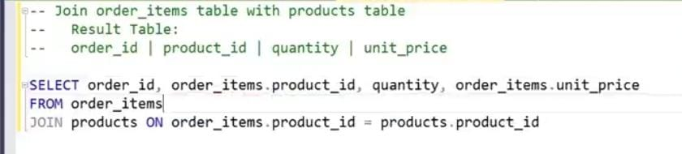

⚡ Data Base 

- مكان منظم بنخزن فيه البيانات بشكل مرتب علشان نقدر نرجع لها ونعدل عليها بسهولة بعدين. زي دفتر كبير بس على الكمبيوتر.
- ✔ أنواع قواعد البيانات المشهورة :

1- Relational Database (علاقات بين البيانات، زي جداول مرتبطة ببعض) ➔ EX: MySQL - PostgreSQL - SQLite

2- NoSQL Database (بيانات بدون جداول ، أنسب للبيانات المرنة) ➔ EX: MongoDB - Firebase Firestore
- ✔ أنواع العمليات الأساسية على الداتا بيز (عمليات CRUD) :

1- Create (إنشاء بيانات جديدة) ➔ INSERT

2- Read (قراءة بيانات) ➔ SELECT

3- Update (تحديث بيانات) ➔ UPDATE

4- Delete (حذف بيانات) ➔ DELETE

EX: 

SQL (*Structured Query Language*):
- [READ-SQL](https://www.w3schools.com/sql/)
- [YOUTUBE-SQL](https://www.youtube.com/watch?v=zpnHsWOy0RY&list=PLP9IO4UYNF0UQkBXlTMSw0CYsxv-GDkkI)

1- إنشاء قاعدة بيانات وجداول:
```
-- إنشاء قاعدة بيانات جديدة
CREATE DATABASE myapp;

-- استخدام قاعدة البيانات دي
USE myapp;

-- إنشاء جدول users
CREATE TABLE users (
    id INT AUTO_INCREMENT PRIMARY KEY,
    name VARCHAR(255) NOT NULL,
    email VARCHAR(255) UNIQUE NOT NULL,
    password VARCHAR(255) NOT NULL,
    created_at TIMESTAMP DEFAULT CURRENT_TIMESTAMP
);
```
2- إضافة بيانات (Create):
```
INSERT INTO users (name, email, password)
VALUES ('Rana', 'rana@example.com', '123456');
```
3- قراءة بيانات (Read):
```
SELECT * FROM users;
```
4- تعديل بيانات (Update):
```
UPDATE users
SET name = 'Sara Mohamed'
WHERE id = 1;
```
5- حذف بيانات (Delete):
```
DELETE FROM users
WHERE id = 1;
```
- SELECT * ➔ return all values
- DISTINCT ➔ return only different values
- ORDER BY ➔ is used to sort the result-set in ascending or descending order (DESC|ASC).
- NULL ➔ is not 0 or " " .

- ✔JOIN ➔ دى لو عندى جدولين عايزه ادمجهم علشان اطلع معلومه معينه

 مثلا عندى جدول فى المثال هنا [JOIN-SQL](https://www.w3schools.com/sql/sql_join.asp)

   عايزه اعرف ال  customerId = 2 
   
   اسمه ايه والاسم ف الجدول التانى فهعمل ايه
```
SELECT Orders.OrderID, Customers.CustomerName, Orders.OrderDate
FROM Orders
INNER JOIN Customers ON Orders.CustomerID=Customers.CustomerID;
```
- ✔CASE
```
EX:
SELECT OrderID, Quantity,
CASE
    WHEN Quantity > 30 THEN 'The quantity is greater than 30'
    ELSE 'The quantity is under 30'
END AS QuantityText
FROM OrderDetails;
```
>> DBMS (Database Management Systems) ➔ هو البرنامج اللي بيدير قواعد البيانات

(SQL) EX:





- [YOUTUBE](https://youtu.be/N-WPYk417yE?si=CIo9C-k3mFW-TkwL)
