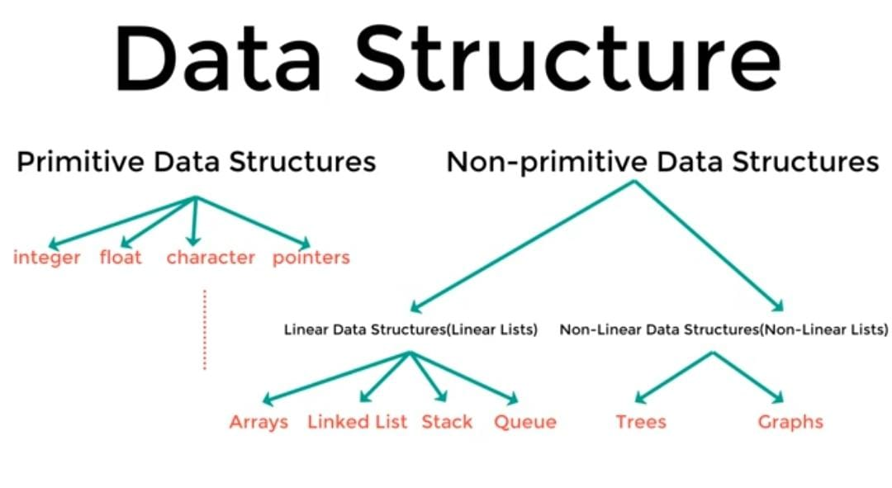
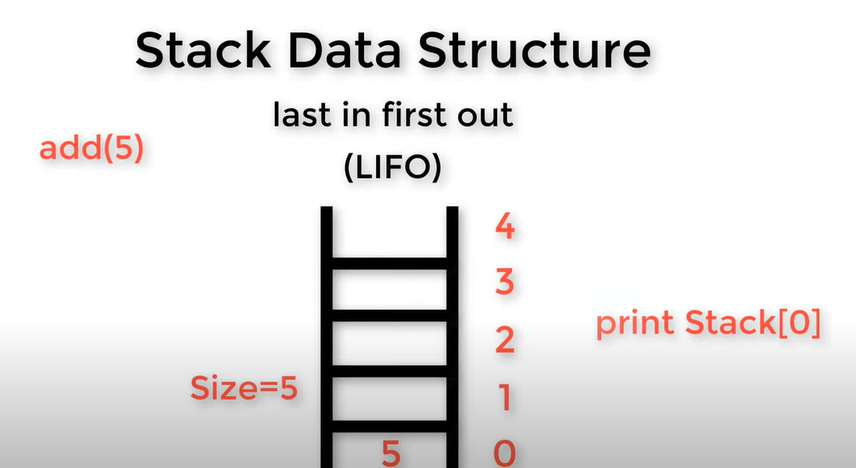
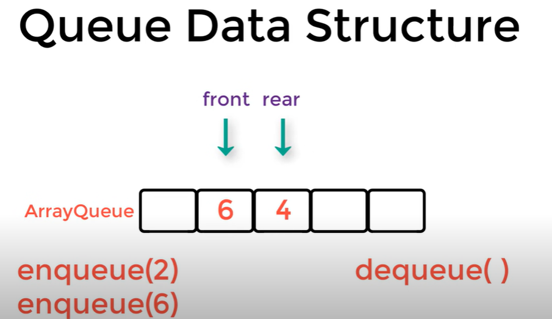

*Data Structure*

👾 *STACK* (LIFO)
Last In First Out
- [top]
- push - pop - getTop - isEmpty
- EX: web pages

👾 *QUEUE* (FIFO)
First In First Out
- The first called front, the last called rear
- enqueue - dequeue - getFront
- EX: printer

