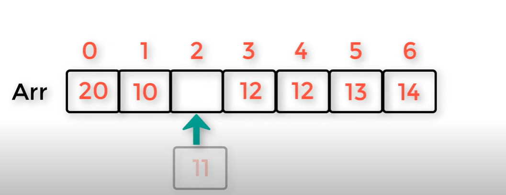
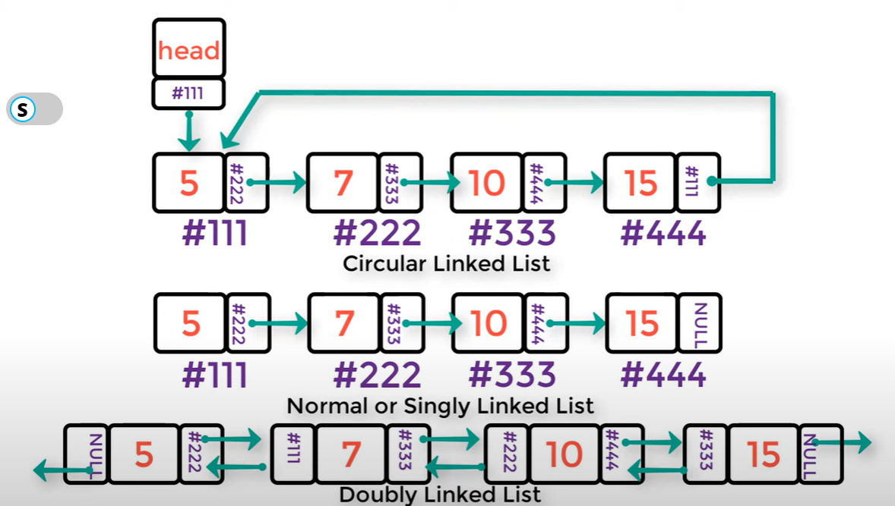
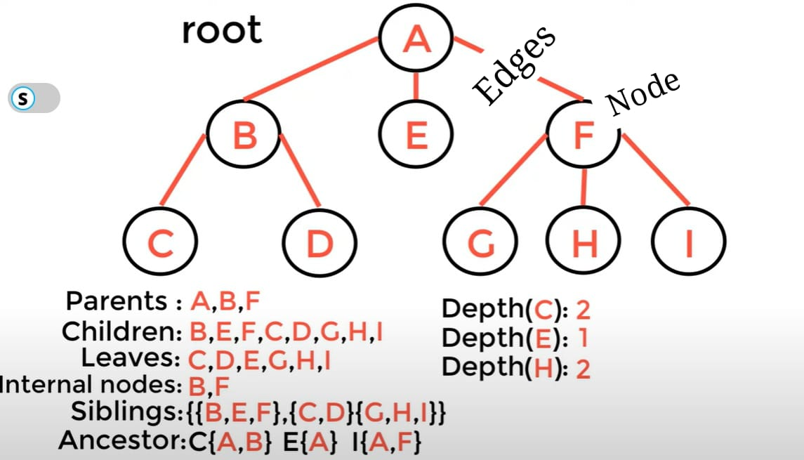
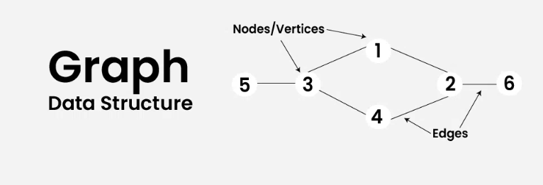

*Data Structure*

⚡ LINEAR DATA STRUCTURES :

👾 *Array*

List (is a collection of item take the same type)
- fixed size 
- sequential
- add - access

👾 *Linked List*

like Array but 
- dynamic size
- not sequential

👾 *STACK* (LIFO)
Last In First Out
- [top]
- push - pop - getTop - isEmpty
- EX: web pages

👾 *QUEUE* (FIFO)
First In First Out
- The first called front, the last called rear
- enqueue - dequeue - getFront
- EX: printer

⚡ NON LINEAR DATA STRUCTURES :

💥 *Tree*

💥 *Graph*

