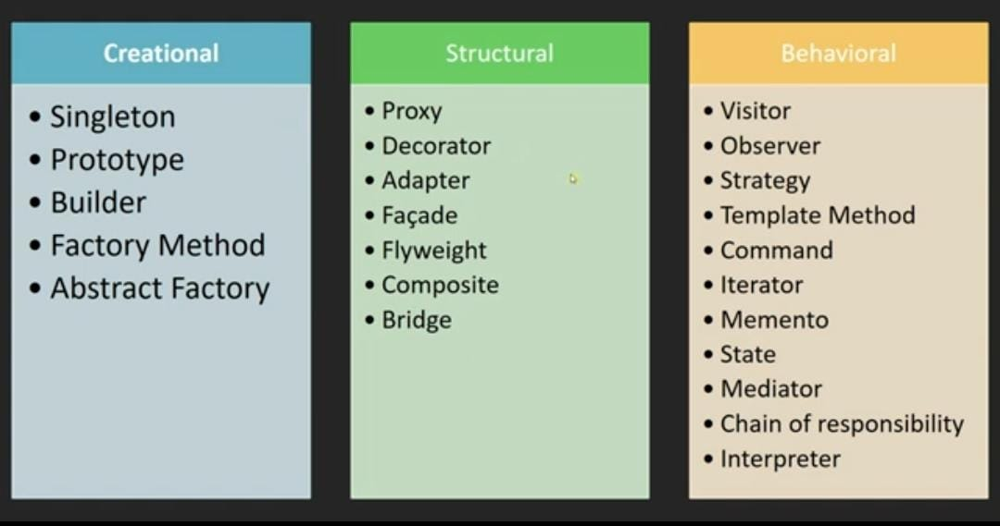

Design Patterns: 

حلول عامه لمجموعه مشاكل شائعه واجهت الناس قبل كده

تنقسم لثلاثه انزاع 

1- Creational

دى بتهتم بال object و class 

2-  Structural

دى بتهتم <بالعلاقات> بين ال class وبعضها وبين ال objects وبعضها
-يعنى العلاقه بين two screens  مثلا 

3- Behavioral

السلوك بتاع ال object او ال class
