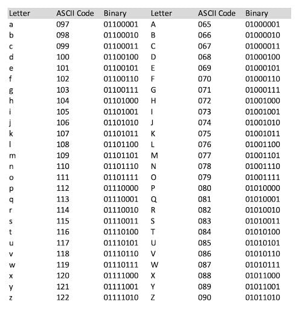

## ⚡1- Relation between object

#### 1️⃣ Composition

Child class depent on father class

EX: if we have home class and room class

لو هدينا الهوم الرووم هتتهد هى كمان معتمدين ع بعض 

#### 2️⃣ Aggregation

Child class independent on father class


لو عندى person class و player class لو ال person مات ال player مش هيموت مش مرتبطين ببعض

#### 3️⃣ Association 

relationship between two or more objects in which the objects have their own lifetime and there is no owner

- [READ](https://medium.com/@bindubc/association-aggregation-and-composition-in-oops-8d260854a446)


## ⚡2- Dependency injection

دا نفس فكره ان اعمل object بس بطريقه تانيه مثلا لو عندى كلاس اسمه Dependency 
وعندى كلاس تانى اسمه Service 
كده لو عاوز اطبق ال Dependency injection 
هروح اعمل فى كلاس ال Service 

final Dependency  dependency ;

وبكده حقنت كل حاجات الكلاس Dependency جوه كلاس ال servise

-وفى مثال عليه فى Dependency inversion code

EX:
```
class Dependency {
  void dependency(){
    print("dependency");
  }
}

class Service {
  final Dependency dependency;   //dependency injection
  Service(this.dependency);
}
```

## ⚡3- Some Principle
1- YAGNI (You Aren't Gonna Need It)
- is a practice in software development which states that features should only be added when required
  
2- KISS (Keep It Simple, Stupid)
  
3- DRY (Don’t Repeat Yourself)

## ⚡4- ASCII Table


## ⚡5- Real-Time Communication
### 1- WebRTC (Web Real-Time Communication):
- يستخدم في التطبيقات التي تتطلب التواصل الفوري عبر الفيديو والصوت
- تستخدم بروتوكول UDP 
### 2- WebSocket
- هو حل للاتصال بين العميل والخادم، ويُستخدم عادة في تطبيقات الرسائل الفورية أو الإشعارات
- تستخدم بروتوكول TCP
### 3 - pusher
- هو خدمة سحابية تسهل استخدام WebSocket بواجهة بسيطة
- تستخدم بروتوكول WebSocket


## ⚡6- UDP and TCP Protocol
### 1- UDP(User Datagram Protocol): أسرع في نقل البيانات، ولكنه قد يفقد بعض الحزم دون تأكيد
### 2- TCP(Transmission Control Protocol): يوفر نقل بيانات موثوق ومتتابع، لكنه أبطأ (EX: WebSocket)


## ⚡7- Pagination
- التقسيم إلى صفحات هو أسلوب يستخدم لتحميل وعرض البيانات على دفعات بدلاً من تحميلها دفعة واحدة، مما يحسن الأداء ويقلل استهلاك الموارد مثل الذاكرة وعرض النطاق الترددي للإنترنت( هي تقنية قوية لتحسين أداء التطبيقات التي تتعامل مع كميات كبيرة من البيانات).
-  ### يستخدم ل :
- 1- تحسين الأداء: تحميل البيانات على دفعات يقلل من استهلاك الذاكرة.
- 2- توفير البيانات بسرعة: بدلاً من انتظار تحميل جميع البيانات، يمكن عرض البيانات الأولية سريعًا ثم جلب المزيد لاحقًا.
- 3- توفير استهلاك الإنترنت: تقليل كمية البيانات المنقولة في كل مرة.

## ⚡8- Compiler - JIT - AOT
1- Compiler :
- بيحوّل كودك مرة واحدة مباشرةً إلى machine code (لغة يفهمها المعالج).
- زي اللي بيحصل في C++.
- النتيجة؟ ✅ تنفيذ سريع جدًا لأن الكود جاهز للتشغيل مباشرة.
  
2- JIT (Just-In-Time Compilation) :
  
- بيحصل أثناء تشغيل البرنامج.
- يعني الكود بيتحوّل إلى machine code أثناء ما البرنامج بيشتغل.
- زي اللي بيحصل في Java (عن طريق JVM) وDart أثناء التطوير.
- ده مفيد وقت التطوير لأنه بيسمح بتجربة سريعة (hot reload)، لكن بيكون أبطأ من الترجمة الكاملة مسبقًا.
  
3- AOT (Ahead-Of-Time Compilation) :

- بيحوّل الكود إلى machine code قبل التشغيل، زي compiler.
- لكن الأداء بيكون مش بنفس كفاءة C++ لأن:
  
1- في Dart، الذاكرة وإدارة الكائنات بتعتمد على Garbage Collector.

2- وفي C++، أنت اللي بتتحكم يدويًا في الذاكرة، وده أسرع في السيناريوهات الحساسة زي الخوارزميات أو المحاكاة الفيزيائية.

### 🚀 السرعة والآداء (Runtime Performance)

1- بتترجم لـ native machine code باستخدام compiler زي g++ وبتديك سرعة عالية جدًا في التنفيذ (C++).

2- بتستخدم JVM لكن مع Just-In-Time (JIT) compilation بيخليها قريبة جدًا من C++ في السرعة (Java).

3- فيها JIT (وقت التطوير) وAOT (وقت التشغيل)، بس مش بنفس الكفاءة في الحسابات الكثيفة أو إدارة الذاكرة الدقيقة اللي مطلوبة في المسابقات (Dart).
