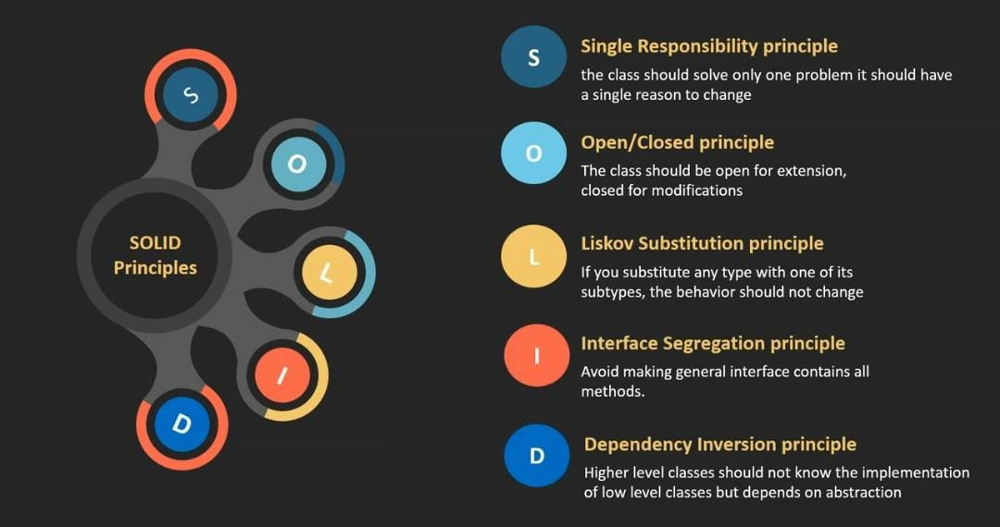

SOLID

1️⃣ S => Single responsibility 
- class should solve only one problem

مثلا لو عندى مستشفى المستشفى دى فيها دكتور واحد بيعالج كل الامراض ذى البرد ، الكلي ، القلب وغيره 
هل دا صح ؟؟
لا غلط لو الدكتور غاب المستشفى كلها مش هتشتغل 
طب لو جبنا دكاتره كتير كل دكتور بيعالج مرض واحد كده الصح 
فلو دكتور فيهم غاب عادى الباقى شغال 
دى نفس الفكره كل كلاس بيقوم بحاجه واحده بس .
  
2️⃣ O => Open closed principle 
- class should Open for extension closed for modification

مثلا لو عندى كلاس اسمه AreaCalc وفيه ميثود بتجيب مساحه شكل معين اسمها getArea
وعملنا فيها لو الشكل دا مثلث رجع معادله معينه ولو الشكل دا مربع رجع معادله معينه تمام 
كده بقى لو عاوزه احسب مساحه مستطيل هضطر اروح اعدل ف الكود واضيف لو الشكل مستطيل رجع معادله دا كده غلط ❌ مينفعش اعدل ف الكود فلازم من الأول خالص اعمل abstract  كلاس اسمه AreaCalc وفيه abstract ميثود اسمها getArea واروح اعمل كلاس للمثلث واخليه يورث من كلاس ال AreaCalc واعمل فيه override للميثود ال في كلاس ال AreaCalc واضيف المعادله 
وبكدا كل ما أعوذ احسب مساحه شكل اعمل كلاس جديد واعمله inheritance بدل ما اعدل ف الكود
 
3️⃣ L => liskov's substitution
- لو الأب  مش موجود الابن هيقوم بالدور مكانه

4️⃣ I => Interface segregation 
- بقسم ال interface الي interfaces صغيره محدده

5️⃣ D => Dependency Inversion

كل من ال high و low class لا يعتمدون علي بعض بل يعتمدون علي abstraction

- [SOLID IN DART](https://dev.to/lionnelt/solid-principles-in-dartflutter-2g21)
- [SOLID IN FLUTTER](https://medium.com/nerd-for-tech/solid-principles-in-a-flutter-32eaf7218476)
